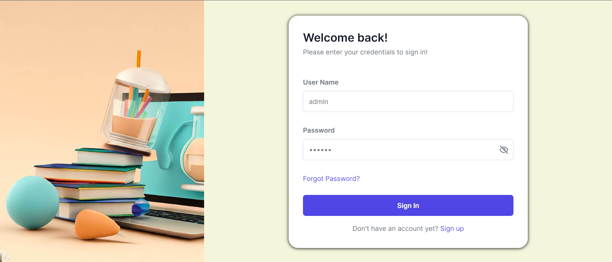
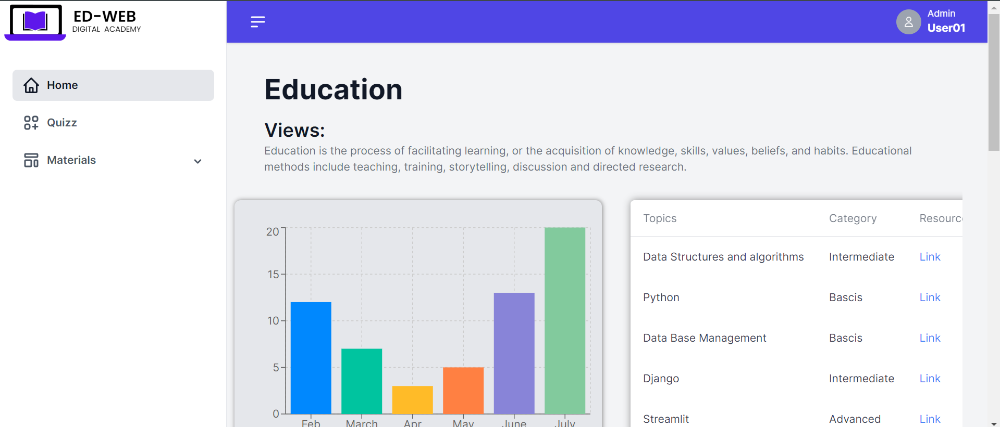
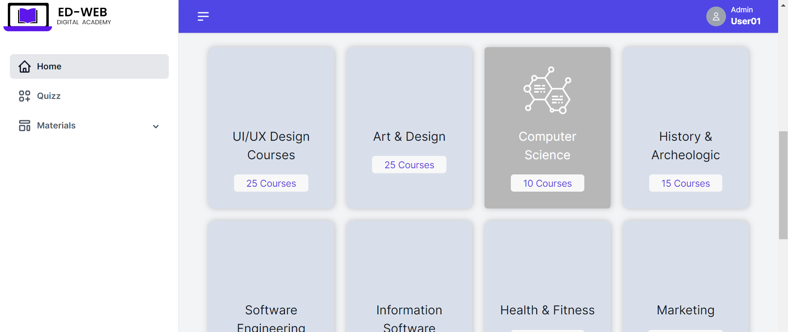
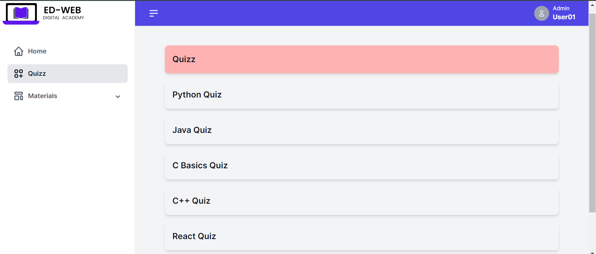
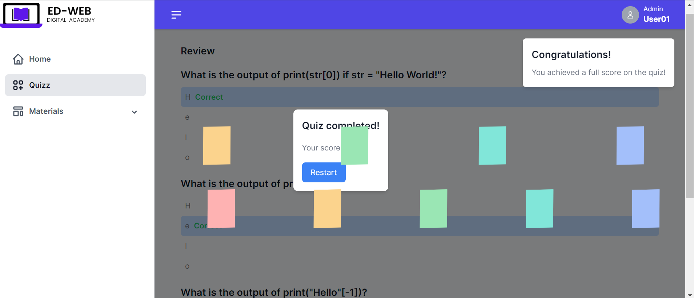
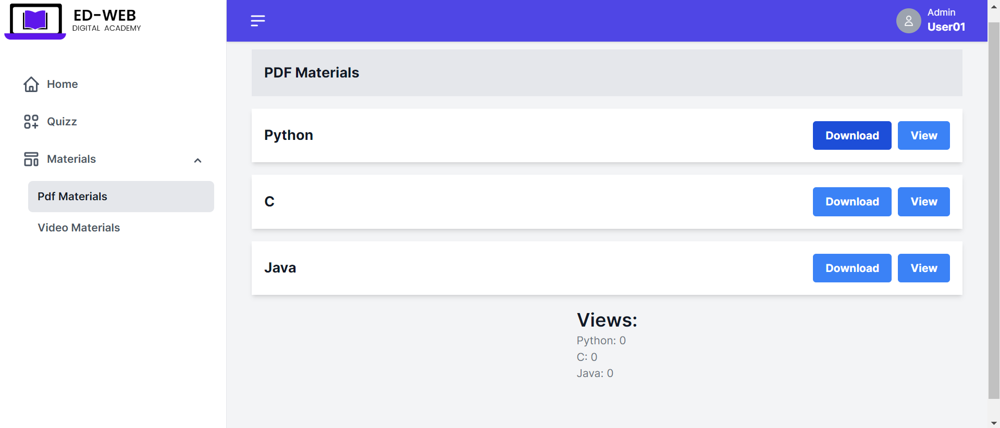
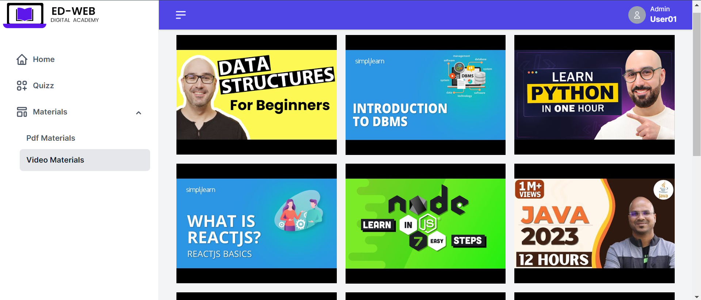
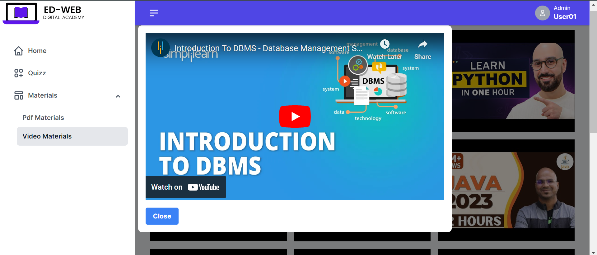

# Edweb
• This project involves the development of a website that serves as an educational platform, providing a wide range of resources and materials for both students and teachers. The website aims to enhance the learning experience by offering study guides, tutorials, interactive quizzes, and downloadable resources.

• The website is built using the React framework, a popular JavaScript library for building user interfaces. This choice of technology ensures a responsive and interactive user experience, making it easy for users to navigate and access the educational content available.
For students, the website offers study guides that cover various subjects and topics, helping them to better understand and grasp the material. These study guides are designed to be comprehensive yet concise, making it easier for students to review and retain important information.
# Outcome:
• The outcome of the project, developed using React, is an educational website that brings a unique and engaging learning experience to users. Leveraging React's interactive user interface capabilities, the webpage offers a dynamic and responsive interface, allowing users to navigate quizzes, study materials, and other sections seamlessly. Real-time updates enhance user engagement by providing instant feedback and progress tracking. The project's use of React's modular architecture ensures scalability and maintainability, enabling easy extension of functionality and streamlined maintenance tasks. 

# Methodology: 
The methodology for developing the educational webpage begins with defining clear objectives and gathering relevant content. The design and wireframing phase focuses on creating an intuitive user experience and visually appealing interface. React is chosen as the primary technology, and additional libraries and APIs are integrated as needed.

## Working prototype of the project:
# Login page

# Dashboard view

# Courses view 

# Quizz page

# Full score celebrating thing in quizz page

# Viewing pdf materials

# Showing grid layout video materials

# Showing video in a model without Advertisment

## Prerequisites

- node
- npm
- yarn (optional)

## steps 
 - npm install
 - npm start

## Installation and Run locally

To get started follow this steps:

- Install packages: `npm install`.
- Start the project locally: `npm run start` (running on port 3000).

## Building Project

To build the app for production run `npm run build`